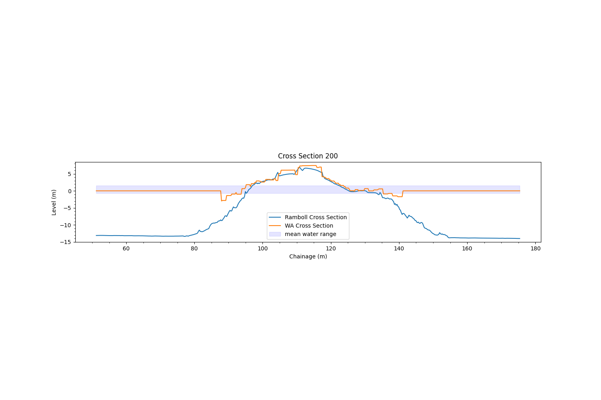

# Cross Section Creator
Cross Section Creator (CSC) is a Python script used to produce cross sections from .xlsx files using the Python library Matplotlib. This README document is designed to inform the reader on how to understand, run and edit the script for your specific requirements.


## Purpose

CSC was developed by Joseph McQuade in summer 2023 for use by Portland Port Ltd. It was created specifically for the regular monitoring of the Potrland Harbour breakwaters. The code blocks themselves contain comments, docstrings and type hints for user understanding. However, the script can be edited in order to produce cross sections for other projects if needed, though an understanding of python would be required.

* CSC can be found and cloned from the main branch on [Github](https://github.com/JoeyMcQuade/Cross-Section-Creator).

## Requirements

Python 3 is required in order to run CSC. Python can be installed from their [website](https://www.python.org/downloads/) or from the [Microsoft store](https://apps.microsoft.com/store/detail/python-310/9PJPW5LDXLZ5).
* The [VS Code](https://code.visualstudio.com/) IDE was used for the entire development of this project. This README will, at points, be VS code specific. As such VS code is recomended but not required - [VS code for Python](https://www.youtube.com/watch?v=-udPvjv8jyI).
* Downloading the requirements will require PIP. PIP is automatically installed with Python 3.4+ but if there are any issue please consult the [PIP documentation](https://pip.pypa.io/en/stable/installation/).

### Requirements.txt

All of the script specific requirements are stored in the requirements.txt file. Please do not edit this file, as it contains relevant information for Python.

* I recommend installing these requirements within a [virtual environment](https://realpython.com/python-virtual-environments-a-primer/) - [VS code tutorial](https://www.youtube.com/watch?v=GZbeL5AcTgw).

From the terminal, directed to the project folder, or from the VS code built-in terminal type:

```console
pip install -r requirements.txt
```
or if that fails try
```console
python -m pip install -r requirements.txt 
```
This will tell pip to read the requirement.txt folder and install the dependancies listed within. 

## Useage

The code is run from the CSC.py file, however, code from the ExcelData.py file is imported and called by CSC.
* CSC.py builds the cross section profiles utilising Matplotlib.
* The ExcelData.py file processes and formats the relevant data from the xlsx file.

### How CSC runs

```python
for x_value in profile_set:       
        cross_section_creator(x_value, first_profile_list, second_profile_list)
```

This is how CSC is run within CSC.py. The profile set contains the unique values that identifies each cross section (0, 5, 10 etc for breakwater cross sections). x_value represents the identifier for each point so the code knows which points relate to which cross sections. The profile set contains value of each cross section profile. The for loop runs the cross_section_creator() function for every x_value in the profile set and therefore creates a cross section for every profile.

### Profile Lists

The two profile list represents the data inside each of the two excel files. They are lists containing lists, each nested list represents the rows in the excel file. They are created as Panda objects from the Python library Panda:

```python
first_df = pd.read_excel(FIRST_SECRET_PATH, engine='openpyxl')
first_profile_list = first_df.values.tolist()
second_df = pd.read_excel(SECOND_SECRET_PATH, engine='openpyxl')
second_profile_list = second_df.values.tolist()
```

The read_excel() function reads the file at the specified file path using the specified file extension engine (The engine for xlsx files in this case). Then each row of the excel file is added to a profile list as a nested list.

* TLDR: The profile lists contain all the information in the excel files.

### The profile_dict_constructor() function
This function is found in the ExcelData.py file. The function takes the information of the profile list and converts it into a dictionary containing only the relevant information (z value and chainage) relating to the relevant profile (x_value) that the CSC for loop is processing.

```python
def profile_dict_constructor(profile_list: list, x_value: int) -> dict:
    """
    Parameters
    ----------
    profile_list: list
        list of lists containing every row in the excel file
    value: int
        value of a profile in the profile_set

    Returns
    -------
        Function returns a dictionary of containing the chainage and z values for every point of a certain profile.
        The profile is determined by the value parameter.
    """

    profile_dict = {x_value: {'Z':[], 'Chainage': []}} #Creates a nested dictionary with two keys and an empty list object as the values.
    for point_profile in profile_list: #For every point in the excel file (Basically every row in excel file)
        if point_profile[0] == list(profile_dict.keys())[0]: #Check if the point profile is part of the cross section currently under construction.
            profile_dict[x_value]['Z'].append(point_profile[3]) #Z values in the point profile are found at index 3. Appends these values to the list value in the nested dictionary key value pair.
            profile_dict[x_value]['Chainage'].append(point_profile[5]) #Chainage values in the point profile are found at index 5. Appends these values to the list value in the nested dictionary key value pair.
    
    return profile_dict #Returns the dictionary once it has been completed.
```
The function accepts a profile list and x_value as its arguement and creates a nested dictionary object. The code then loops through every point in the profile list (ie every row in the excel file). If a point has the same cross section value as the current x_value it appends the Z and chainage of the point to the nested dictionary. Once complete the code returns the dictionary.

* TLDR: The function creates a dictionary for the current cross section (specified by the x_value variable) which contains a dictionary storing the z and chainage values of every point for the current cross section.

### The cross_section_creator() function

```python
def cross_section_creator(value: int, first_profile_list: list, second_profile_list: list):
        """
        Parameters:
        -----------
        value: int
                value of a profile in the profile_set
        profile_list: list
                list of lists containing every row in the excel file

        Notes
        -----
        Does not return anything, but produces a graph utilising matplotlib for all profiles in the profile list.
        """
        first_profile_dict = profile_dict_constructor(first_profile_list, value)
        second_profile_dict = profile_dict_constructor(second_profile_list, value)

        plt.clf() #Clears matplotlib frame so that each cross section produced is not overlain with data from previous cross sections. 

        plt.figure(figsize=(15, 10))
        plt.title(f'Cross Section {value}')
        plt.xlabel('Chainage (m)')
        plt.ylabel('Level (m)')

        #Takes the relevant values from the profile dictionaries to create list objects containing the values relevant for the x and y positions of each plot.
        first_x = first_profile_dict[value]['Chainage']
        first_y = first_profile_dict[value]['Z']
        second_x = second_profile_dict[value]['Chainage']
        second_y = second_profile_dict[value]['Z']

        plt.minorticks_on() #Plots the minor ticks in between the major ticks
        plt.plot(first_x, first_y, label = 'Waterhouse Cross Section') #Plots a line using values from the first profile list (The first data frame)
        plt.plot(second_x, second_y, label = 'Ramboll Cross Section') #Plots a line using values from the second profile list (The second data frame)   
        plt.fill_between(second_x, -0.74, 1.54, color='b', alpha=0.1, label="mean water range") #Plots the mean water range
        plt.subplot().set_aspect('equal') #Ensures a natural scale
        plt.legend() #Creates the legend for regions displayed on the graph
        plt.savefig(f'{PNG_PATH}//Cross Section {value}.pdf') #Saves the resulting graph to the specified filepath. Changing the file suffix (eg .pdf/.png) changes the format of the file.
```

This function is found in the CSC.py file. It accepts the two profile lists and the x_value as arguements. Firstly, the function calls the profile_dict_constructor described previously to create the profile_dict variables.

The values stored in the dictionaries are then assigned to x and y variables (chainage and z). Matplotlib then plots lines based on these x and y values. Two lines are plotted so that previously created cross sections can be compared to modern cross section so that a comparison can be created. 

Also plots a mean water height area and a ensures that the plot scales are kept natural.

* TLDR: Plots line based on x and y values found in profile_dicts produced by the profile_dict_constructor() function. Then saves the file in the specified format to the output file path provided.

## Summary

1. Collects information found in the excel files.
2. Creates a set that containing the values that identify each cross section (x_value).
3. Runs cross_section_creator() function for each x_value in the set.
4. excel information (stored as the profile lists) then converted into dictionaries by the profile_dict_constructor() function. Dictionaries contain only the relevant for z and chainage data for the points that are part of the cross section specified by the x_value.
5. From these dictionaries x and y values are assigned and then plotted onto a graph.
6. Matplotlib plots minor ticks, legend and naturalises the scale to ensure graph useablity.
7. Cross section is then save in the specified format to the specified file path.
8. This process repeats for every x_value leaving the user with a multiude of cross sections.

## Example output
